# 🏕️ Tourist Company — Адаптивний сайт

Цей проект — це адаптивний сайт туристичної компанії, створений з фокусом на чисту верстку, логічну структуру, та візуальну естетику. Він демонструє мої навички роботи з HTML, CSS, SVG-іконками та мобільною оптимізацією.

---

## 🌐 Особливості

- ✅ 3 HTML-сторінки, пов’язані внутрішніми посиланнями
- 🎨 Стилізація через спільний `style.css`
- 🖼️ Папка `img/` з іконками та графікою
- 📱 Адаптивний дизайн для мобільних та планшетів
- 🔗 Навігація між сторінками без перезавантаження

---

## 🛠️ Використані технології

- HTML5, CSS3
- Flexbox, Media Queries
- SVG-іконки, PNG
- VS Code + Git + GitHub

---

## 📂 Структура проекту

touristCompany_adaptive
-- index.html
-- style.css
--icons_exam_task2

---

## 🎯 Мета проекту

Сайт демонструє вміння створювати адаптивні, візуально привабливі інтерфейси, які можуть бути основою для реальних туристичних продуктів чи платформ.

---

## 💡 Авторка

**Оксана Дубова**  
Frontend Learner | GitHub Explorer | UI Enthusiast

- GitHub: [oksanaDubova-hub](https://github.com/oksanaDubova-hub)
- Email: oxdubova@gmail.com

---
## 🖼️ Скриншоти інтерфейсу

### 📍 Головна сторінка
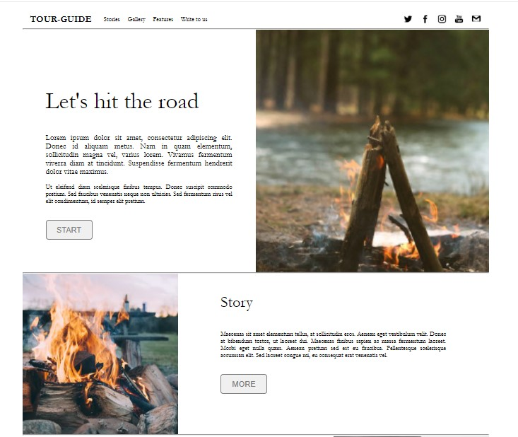
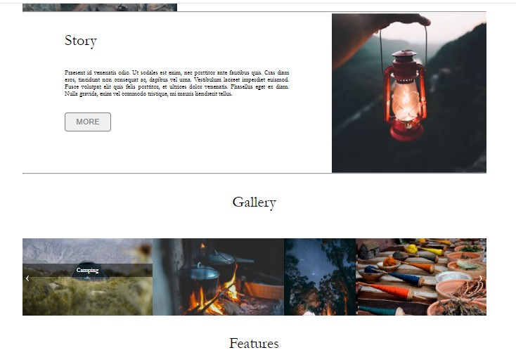
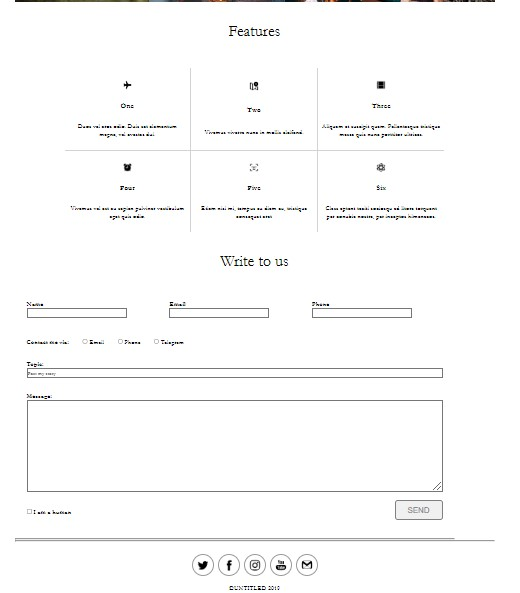

### 📱 Адаптивна версія для планшетів

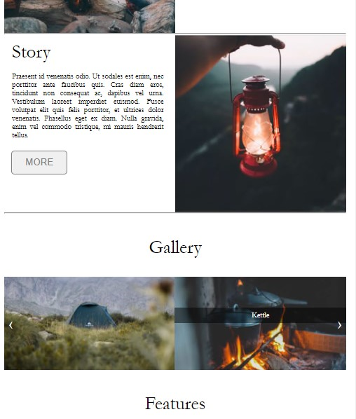
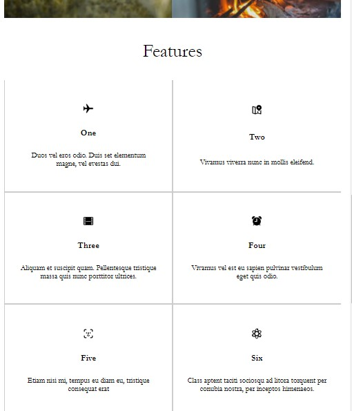
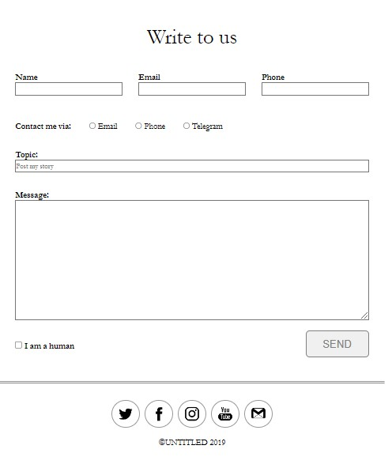

### 📱 Адаптивна мобільна версія
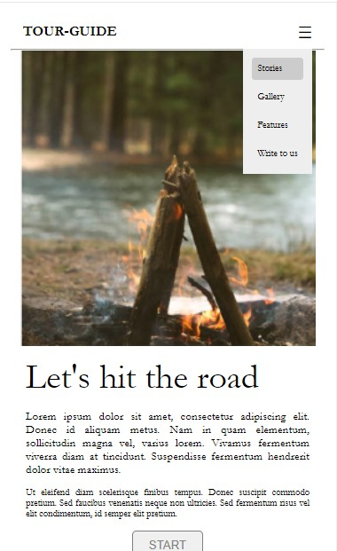
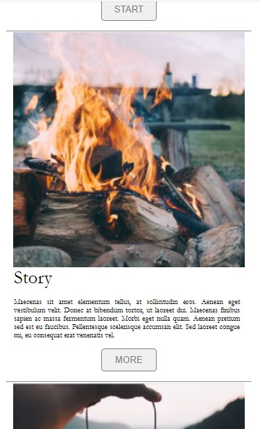
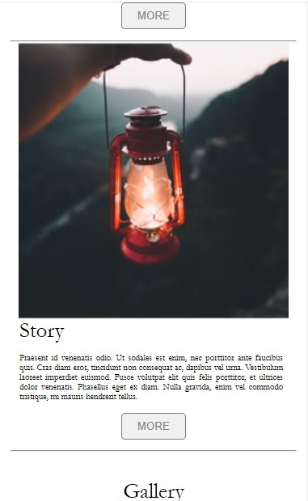
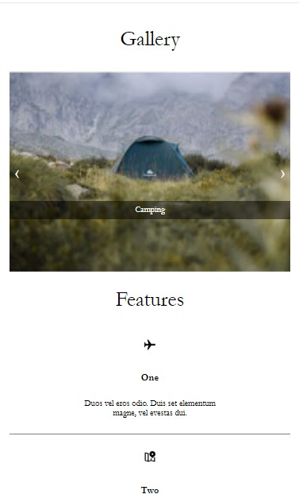
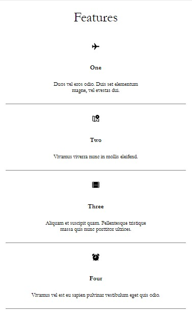
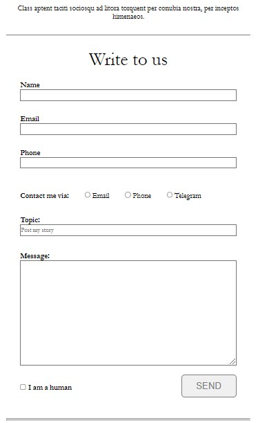
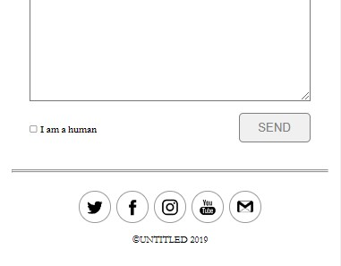

